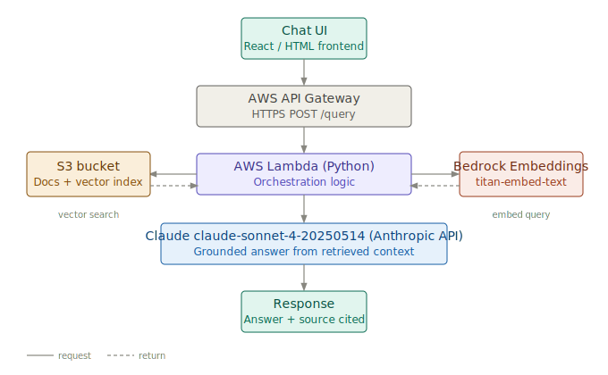

# RAI — Runbook AI

A serverless RAG pipeline that answers questions from internal documentation in under 5 seconds. Built on AWS using API Gateway, Lambda, Bedrock embeddings, S3, and Claude.

Demoed at AWS Summit London 2026.

---

## What it does

Engineers type a question. RAI retrieves the most relevant context from your documentation and returns a grounded answer. No hallucinations — Claude only answers from the retrieved context.

Point it at your own documents by dropping `.txt` files into the `documents/` folder and running the ingestion script once.

---

## Architecture



User → API Gateway → Lambda (Python) → Bedrock Titan embeddings → cosine similarity → S3 vector store → Claude → response

- **Frontend:** Static HTML + JavaScript
- **API:** Amazon API Gateway (HTTP)
- **Backend:** AWS Lambda (Python 3.13)
- **Embeddings:** Amazon Bedrock — Titan Embed Text V2
- **Vector store:** Amazon S3 (JSON)
- **Generation:** Claude via Anthropic API

---

## Architectural decisions and tradeoffs

**S3 over a vector database (Pinecone, OpenSearch)**
For under 1,000 document chunks, the latency difference is negligible. S3 removes an external dependency entirely and keeps the architecture simple. At 10,000+ chunks, retrieval slows and a dedicated vector database like OpenSearch becomes the right call.

**Lambda over EC2**
Usage is unpredictable — you don't pay for compute sitting idle. Lambda scales to zero between queries. If this became latency-critical or needed persistent connections, ECS would be the next step.

**RAG over fine-tuning**
Documents change constantly. RAG keeps knowledge separate from the model — update a text file, not a model. Fine-tuning locks knowledge in and requires retraining every time something changes.

**Cosine similarity in plain Python over a framework**
No LangChain, no orchestration layer. Every component is visible and debuggable. The tradeoff is manual implementation — worth it at this scale for clarity and control.

---

## What it solves

Engineers waste time searching Confluence, Notion, and internal wikis for answers that should take seconds. RAI turns any documentation into a queryable knowledge base running on infrastructure you already own. Data never leaves your AWS account — relevant for compliance and security requirements.

---

## Running it yourself

**Prerequisites**
- AWS account with API Gateway, Lambda, S3, and Bedrock access
- Anthropic API key
- Python 3.13

**1. Ingest your documents**
Drop `.txt` files into the `documents/` folder, then run:
```bash
python3 ingest.py
```
This embeds each chunk via Bedrock and saves the vector store to S3.

**2. Deploy the Lambda function**
Package and upload `lambda_function.py` with dependencies to AWS Lambda. Set the following environment variables:
- `ANTHROPIC_API_KEY`
- Update the S3 bucket name in the function code

**3. Open the frontend**
Open `index.html` in a browser. Update the API Gateway URL in the fetch call to point to your deployed endpoint.

---

## Cost

Near zero at this scale. Lambda, API Gateway, and S3 are within AWS free tier for low usage. The only real cost is Bedrock embedding calls and Claude API calls — approximately £3–5 to build and test the full project.

---

## Next steps (AgentRAI)

The next version introduces a ReAct loop — Claude reasons across multiple retrieval steps and takes actions (creating GitHub Issues) based on what it finds. Evals comparing embedding-based retrieval against agentic search are in progress, following suggestions from an applied AI engineer at Anthropic.

---

Built by [Amaan Miah](https://github.com/amaan-miah) during AWS re/Start, 2026.
